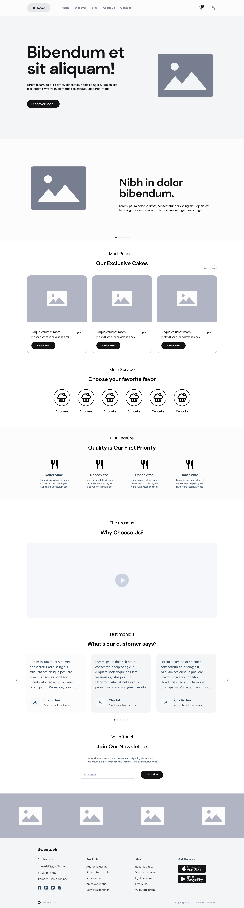

# E-Commerce Platform Development

## Overview
This project is an e-commerce platform with features divided into **Client**, **Staff**, and **Administration** functionalities. The assignments are organized into sections and roles for a smooth development process.

---

## Table of Contents
- [Client Features](#client-features)
- [Staff Features](#staff-features)
- [Administration Features](#administration-features)
- [Database Responsibilities](#database-responsibilities)

---

## 1. Client Features
These features are accessible to customers.

### Developer 1: User Registration and Authentication
- **Front-End:**
  - **User Registration Form**: Fields for username, email, password, with validation messages.
  - **Login Form**: Fields for email, password, with "Forgot Password" functionality.
  - **User Profile Page**: View and edit personal information.
  
- **Back-End:**
  - **Routes**:
    - `POST /register`: Handles user registration.
    - `POST /login`: Authenticates users and creates sessions.
  - Implements password hashing and validation.

---

### Developer 2: Product Browsing and Ordering
- **Front-End:**
  - **Product Listing Page**: Display products with images, names, prices, "Add to Cart" buttons.
  - **Product Detail Page**: Shows detailed product information.
  - **Filtering Options**: E.g., by category, price range.

- **Back-End:**
  - **Routes**:
    - `GET /products`: Retrieve product list.
    - `GET /products/{id}`: Fetch details of a specific product.
  - Implement database queries using Eloquent ORM.

---

### Developer 3: Shopping Cart and Checkout Process
- **Front-End:**
  - **Shopping Cart Interface**: Display selected items, quantities, total price. Options to update quantities or remove items.
  - **Checkout Page**: Forms for shipping information and payment details.

- **Back-End:**
  - **Routes**:
    - `POST /cart`: Handle adding items to the cart.
    - `POST /checkout`: Process the order and save to the database.
  - Implement session management and payment processing logic.

---

## 2. Staff Features
These features are designed for staff use.

### Developer 4: Staff Product Management
- **Front-End:**
  - **Product Management Interface**: Forms for adding, editing, deleting products.

- **Back-End:**
  - **Routes**:
    - `POST /admin/products`: Handle new product submissions.
    - `PUT /admin/products/{id}`: Update product information.
    - `DELETE /admin/products/{id}`: Remove products from the database.
  - Implement product data validation.

---

### Developer 5: Order Management for Staff
- **Front-End:**
  - **Order Management Dashboard**: Display list of all orders with statuses (e.g., pending, completed).

- **Back-End:**
  - **Routes**:
    - `GET /admin/orders`: Retrieve all orders.
    - `PUT /admin/orders/{id}`: Update the status of an order.
  - Implement order retrieval and status updates.

---

### Developer 6: Customer Support Features
- **Front-End:**
  - **Support Ticket Form**: Allow users to submit inquiries or issues.

- **Back-End:**
  - **Routes**:
    - `POST /support/tickets`: Handle support ticket submissions.
    - `GET /support/tickets`: Retrieve tickets for staff review.
  - Implement notification logic for new tickets.

---

## 3. Administration Features
These features are for administrative users.

### Developer 7: Staff Management for Administration
- **Front-End:**
  - **Staff Management Interface**: Forms to add, edit, delete staff members.

- **Back-End:**
  - **Routes**:
    - `POST /admin/staff`: Add new staff members.
    - `PUT /admin/staff/{id}`: Update staff information.
    - `DELETE /admin/staff/{id}`: Remove staff from the database.
  - Implement role-based access control.

---

### Developer 8: Payment Processing
- **Front-End:**
  - **Payment Integration**: Forms for users to enter payment information during checkout.

- **Back-End:**
  - **Routes**:
    - `POST /payment`: Handle payment submissions and confirmations.
  - Implement payment gateway integration and store payment confirmations.

---

## Database Responsibilities
The database team will handle the design and management of the database.

### Database Design:
- **Schema**: Design for users, products, orders, staff, support tickets.
- **Migrations**: Set up Laravel migrations to create the necessary tables.

### Data Management:
- **Data Integrity**: Ensure proper data validation and integrity.
- **Optimizations**: Optimize database queries for performance.

---

## Development Team
- **Developer 1**: User Registration and Authentication
- **Developer 2**: Product Browsing and Ordering
- **Developer 3**: Shopping Cart and Checkout Process
- **Developer 4**: Staff Product Management
- **Developer 5**: Order Management for Staff
- **Developer 6**: Customer Support Features
- **Developer 7**: Staff Management for Administration
- **Developer 8**: Payment Processing
- **Database Team**: Database Design and Management

## Contributing
For contributing guidelines, please check the `CONTRIBUTING.md` file.

---

